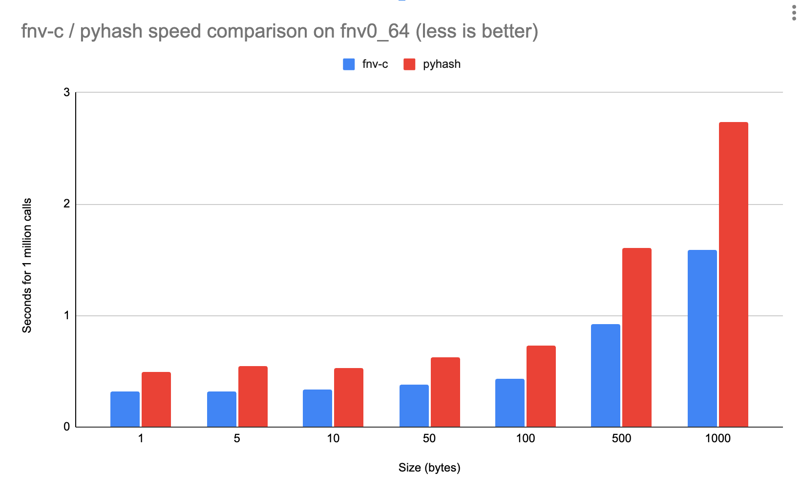
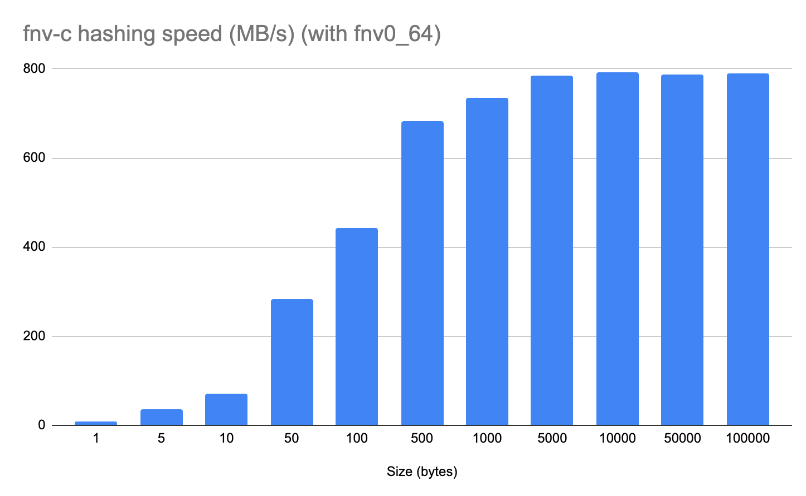

# fnv-c

[](https://github.com/botify-labs/fnv-c/actions/workflows/ci.yaml)
[](https://pypi.org/project/fnv-c/)

## What is it?

**fnv-c** is a Python 3.7+ FNV (`fnv0`, `fnv1`, `fnv1a`) **non-cryptographic** hash library implemented in C through libffi.

FNV ("Fowler–Noll–Vo") is is a non-cryptographic hash function created by Glenn Fowler, Landon Curt Noll, and Kiem-Phong.
FNV is probably not the "best" non-cryptographic hash function but:

- it has a reasonably good distribution
- it's very fast
- it's very easy to implement *(even in some exotic stored procedures for example)* so you can use it everywhere

More details on [this Wikepedia article](https://en.wikipedia.org/wiki/Fowler%E2%80%93Noll%E2%80%93Vo_hash_function).

## Features

- speed: 
    - up to **800 MB/s** hashing speed *(on Macbook Pro M1 (2020) with `fnv0_64`)*
    - **6 800%** faster than basic Python implementation, **70%** faster than `pyhash` *(when hashing 100 bytes with `fnv0_64` on a cloud VM)*
- portability:
    - tested with recent Python versions (3.7+)
    - compatible with ARM64
    - compatible (and tested) with PyPy

## Non features

- other hash algorithms *(this library is only about FNV algorithm)*
- too agressive CPU optimizations *(we prefer maximizing binary portability)*

## Benchmark

You have a benchmark script [here](bench.py) to bench `fnv-c` by yourself and to compare it with:
- [`fnvhash`](https://github.com/znerol/py-fnvhash) (pure python implementation)
- [`pyhash`](https://github.com/flier/pyfasthash) (more general hashing library with C++ extension)

### Comparisons with other libraries (`fnv0_64` on a cloud VM)

Differences with `fnvhash` are huge (from **35%** for one byte hashing to **19 000%** for 1 000 bytes hashing with `fnv0_64`)

Differences with `pyhash` (on `fnv0_64`) are shown with the following diagram:



### Influence of string size on `fnv-c` hashing speed (on a Macbook Pro M1 (2020) with `fnv0_64`)



## How to install/use it?

```
pip install fnv-c
```

```python
import fnv_c

print(fnv_c.fnv0_32(b"foo bar"))
print(fnv_c.fnv0_64(b"foo bar"))
print(fnv_c.fnv1_32(b"foo bar"))
print(fnv_c.fnv1_64(b"foo bar"))
print(fnv_c.fnv1a_32(b"foo bar"))
print(fnv_c.fnv1a_64(b"foo bar"))
```

## Function signatures / API

Full API doc is available at: [https://botify-labs.github.io/fnv-c/fnv_c/](https://botify-labs.github.io/fnv-c/fnv_c/)

## Contributing

See [CONTRIBUTING](./CONTRIBUTING.md)

## License

**fnv-c** is licensed under the [MIT license](./LICENSE).
